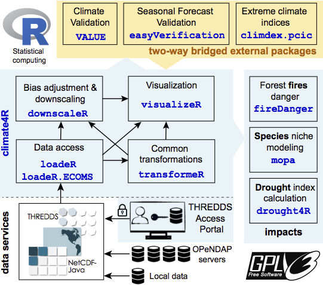
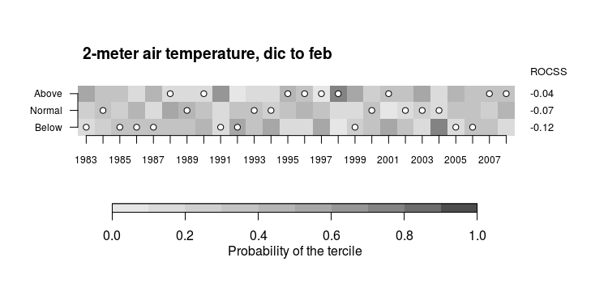
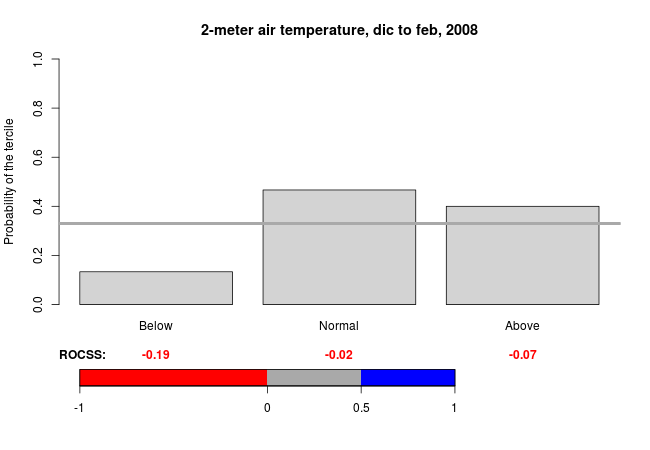
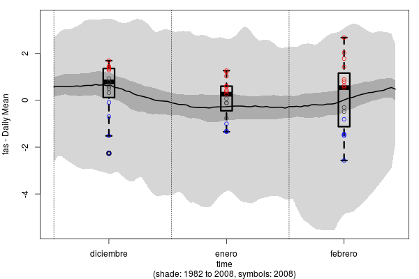
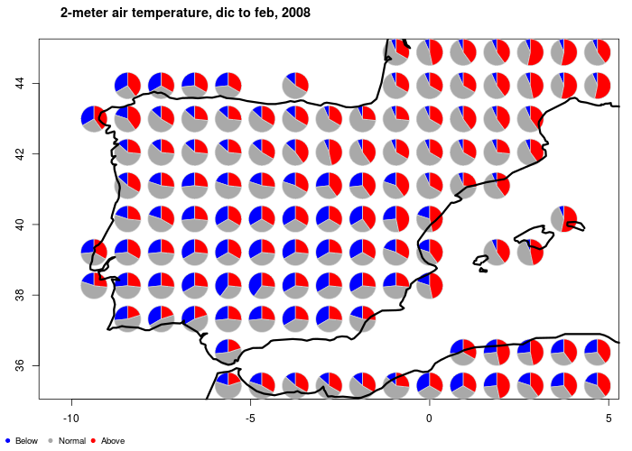

##Visualización de datos meteorológicos con Climate4R y visualizeR

**VisualizeR** es un paquete para R que permite visualizar y transmitir la incetidumbre en la predicción del tiempo, según el título del [artículo consultado](https://www.sciencedirect.com/science/article/pii/S1364815217305157) para realizar este documento.

A su vez, **visualizeR** forma de **Climate4R**, que es un conjunto de herramientas para trabajar de forma transparente con datos climáticos y su visualización. Profundicemos un poco en ello.

###Climate4R

Como se indica en la propia introducción del articulo antes mencionado: "El interés en la predicción meteorológica ha crecido rápidamente en muchos sectores socioeconómicos debido al gran potencial de las mismas en cuanto a la toma de decisiones. Sin embargo, la aplicación práctica de esas predicciones aún están siendo muy obstaculizadas debido a la falta de herramientas que permitan una comunicación efectiva de la incetidumbre a los usuarios no expertos en el campo". De ahí la importancia de la herramienta de la que hablamos.



**Climate4R** es una herramienta creada por el [http://www.meteo.unican.es/es/main](Grupo de Meteorología de Santander), un grupo formado por profesores e investigadores de la Universidad de Cantabria y el Consejo superior de Investigaciones Científicas (CSIC). Esta herramienta trabaja con datos de cuadrículas espaciales (datos de zonas delimitadas geográficamente) y estaciones y los combina de forma que son capaces de obtener predicciones climáticas. 

Así pues, **Climate4R** no se limita a mostrar datos gráficamente, sino realiza más tareas, de ahí que esté formado por otros paquetes:

  * **loadeR**: permite el acceso a datos climáticos de forma transparente al usuario, permitiendo cargar datos tanto locales como remotos (desde servidores OPeNDAP). Es ideal para el análisis y predicción meteorológica, ya que facilita la obtención de los datos necesarios para ello.
  * **transformeR**: permite la realización de tareas de manipulación de información, incluyendo la generación de subconjuntos, reorganización, y conversión de datos.
  * **downscaleR**: se encarga del procesado de los datos, usando las aproximaciones y técnicas más populares.
  * **visualizeR**: el paquete que nos ocupa en este documento, se centra en la visualización de predicciones y de incertidumbres. Contiene funciones de visualizaciones de datos climatológicos, predicciones, evaluaciones, y combinaciones de todo lo anterior.
  
**Climate4R** es compatible con otros muchos paquetes de R dedicados al estudio de impacto, está licenciado bajo GNU y disponible en su [https://github.com/SantanderMetGroup](repositorio GitHub).

###VisualizeR

Como decíamos, **visualizeR** forma parte de un conjunto de herramientas superior, pero como lo que nos interesa es la **visualización**, nos centraremos en esta parte de la herramienta. Vamos a ver qué funcionalidades principales incluye este paquete paso a paso.

####Instalación

Para obtener el paquete y llevar a cabo la instalación, tendremos que descargar el código desde github, por lo que además necesitaremos tener instalado y cargado previamente el paquete **devtools**. Previo al propio paquete **visualizeR**, necesitaremos instalar otro de los paquetes de **Climate4R** llamado **transformeR** (lleva un rato la instalación, así que paciencia)

```{r eval=F}
library(devtools)
devtools::install_github(c("SantanderMetGroup/transformeR", "SantanderMetGroup/visualizeR"))
```

Por suerte, los datos de los ejemplos vienen incluidos en la propia instalación de los paquetes, por lo que no tendremos que preocuparnos en buscar datos con el formato adecuado para visualizar el funcionamiento del paquete.

```{r}
library(transformeR)
library(visualizeR)
```

Como siempre, es buena idea inspeccionar los datos con los que vamos a trabajar, para saber qué nos vamos a encontrar y como poder manipularlo si fuera necesario:

```{r}
data("CFS_Iberia_tas")
class("CFS_Iberia_tas")
mode("CFS_Iberia_tas")
str("CFS_Iberia_tas")
head("CFS_Iberia_tas")
```

Es decir, en ralidad lo que tenemos es una lista de propiedades relacionadas con datos meteorológicos como son fechas, coordenadas, y los propios datos meteorológicos.

Con esto, ya podemos comenzar a ver las funciones de visualización propiamente dichas.

####Función spatialPlot para la visualización espacial

La función **spatialPlot** no es más que un envoltorio de algunas de las funciones de construcción de gráficas de **lattice** para datos espaciales (spplot). Sin embargo, **spatialPlot** añade sus propios argumentos:
 
* **backdrop.theme**: permite facilmente especificar limites terrestres como costas o fronteras a ser mostrados en la gráfica
* **set.min** y **set.max**: opciones que evitan la distorsión gráfica por parte de valores extremos (pensad por ejemplo en valores extremos de temperaturas que puedan distorsionar la representación gráfica pese a ser valores *outliers*).
* **lonCenter**: selección de la coordenada de longitud central para el mapa a representar.

Esta función ha sido construida para la representación de cuadrículas climatológicas, en los cuales cada porción del mapa está representado por un valor, el cual posiblemente haya sido computado por el otro paquete instalado, **transformeR**. Veamos un primer ejemplo, en el cual se obtiene lo que se llama **climatología** a partir de la función del mismo nombre (climatology) y la muestra en tantos mapas como **miembros** contengan los datos pasados como argumento:

```{r}
CFS_Iberia_tas$Members
clim <- climatology(CFS_Iberia_tas, by.member = TRUE)
spatialPlot(clim)
```

Podemos modificar la función y hacer que se muestre la línea de costa de, en este caso, la región a la que corresponden los datos, en este caso, España. Para ello se usa el argumento antes mencionado **backdrop.theme**:

```{r}
spatialPlot(clim, backdrop.theme = "coastline", set.min = 5, set.max = 14)
```

También podemos centrar nuestra visualización a unos miembros en concreto. Por ejemplo, si por algún motivo me resulta interesante ver tan solo los miembros 1 y 9:

```{r}
spatialPlot(clim, backdrop.theme = "coastline", zcol = c(1,9))
```

La paleta de colores puede ser cambiada a nuestro gusto (en este caso solo muestro el "miembro" del dataset número 1):

```{r}
spatialPlot(clim, backdrop.theme = "coastline", zcol = 1, col.regions = cm.colors(56), at = seq(10,37,1))
```


Podemos también mostrar la ubicación de las estaciones usadas en la obtención de los datos.

```{r}
data("VALUE_Iberia_pr")
spatialPlot(climatology(VALUE_Iberia_pr),  colorkey = TRUE,  backdrop.theme = "countries")
```


####Función temporalPlot para visualización de series temporales

Esta función también es un envoltorio de una función del paquete **lattice**, concretamente de **xyplot**, el cual a su vez tiene como objetivo la representación de series temporales, como era de esperar.

A dicha función, **temporalPlot** le añade ciertos argumentos:

* **aggr.spatial**: controla la función a ejecutar para la agragación espacial.
* **cols**: controla el color de las líneas en cada serie
* **lwd**: controla la anchura de las lineas en las series
* **lty**: controla el tipo de lineas a usar
* **show.na**: representa los valores perdidos o valores **NA**, con puntos grises

Vamos a ver un ejemplo en el que se compararan dos series temporales: la primera pertenece a una predicción y la segunda a una observación, ambas sobre el mismo territorio. Para ello, seleccionamos previamente un intervalo, ya que no queremos representar todos los datos (lo cual haría la gráfica ilegible). Para ello se usa la función **subsetGrid** de **transformeR**:

```{r}
data("CFS_Iberia_tas")
data("EOBS_Iberia_tas")

forecasts <- subsetGrid(CFS_Iberia_tas, years = 1998:2000)
observations <- subsetGrid(EOBS_Iberia_tas, years = 1998:2000)
temporalPlot("Observations" = observations, "Forecasts" = forecasts)
```

**En esta gráfica, se ven espacios en blanco ya que estos datos se corresponden únicamente a datos invernales.**

Si vualizamos un único año, vemos que los datos en blanco desaparecen porque la gráfica únicamente muestra el intervalo de tiempo para el que si hay datos:

```{r}
forecasts <- subsetGrid(CFS_Iberia_tas, years = 2000)
observations <- subsetGrid(EOBS_Iberia_tas, years = 2000)
temporalPlot("Observations" = observations, "Forecasts" = forecasts)
```

Podemos seguir usando **subsetGrid** para hacer que la gráfica solo muestre los datos de una sola localización, es decir, en este caso no existiría agregación espacial, ya que es como si solo mostraramos los datos de un punto espacial.

Primero delimitamos mediante coordenadas con los argumentos correspondientes:

```{r}
forecasts <- subsetGrid(CFS_Iberia_tas, years = 1999:2000)
observations <- subsetGrid(EOBS_Iberia_tas, years = 1999:2000)
forecastsForPoint <- subsetGrid(forecasts, lonLim = 2, latLim = 42)
observationsForPoint <- subsetGrid(observations, lonLim = 2, latLim = 42)
```

Y a continuación tan solo tendríamos que volver a usar la función para mostrar la evolución temporal (con **show.na** iniciado a TRUE conseguimos que se muestren los valores perdidos o no disponibles):

```{r}
temporalPlot("Observations" = observationsForPoint, "forecasts" = forecastsForPoint, cols = c("green", "deeppink"), show.na = TRUE,  xyplot.custom = list(main = "winter temperature", ylab = "Celsius"))
```


####Función tercileMap para visualización probabilistica

Esta función estratifica las probabilidades según percentiles, de manera que devuelve un mapa que muestra las zonas que han aumentado su probabilidad de estar por encima o por debajo del tercile superior o inferior. En otras palabras, agrupa los datos en terciles, y en base a datos observacionales y predicciones, nos indica qué zonas son propensas a acercarse a datos pertenecientes a un tercil inferior o superior. Veamoslo con un par de ejemplos.

Tomando los datos de la peninsula ibérica disponibles en el propio paquete, se toman los datos desde el año 1983 hasta 2001 como datos observacionales, y los datos del año 2002 como si furan datos de predicciones. Una vez que tenemos ambos conjuntos de datos, tan solo tenemos que enfrentarlos en la gráfica correspondiente ejecutando la función **tercileMap**

```{r}
data(CFS_Iberia_tas)
hindcast <- subsetGrid(CFS_Iberia_tas, years = 1983:2001)
forecast <- subsetGrid(CFS_Iberia_tas, years = 2002)
tercileMap(hindcast, forecast)
```

Como estos datos son relativos a las tempraturas invernales, interpreto que las zonas de azul oscuro tienen una posiblidad entre el 60 y 70% de acercarse al tercil inferior, mientras que la zona aguamarina tiene un porcentaje de entre el 50 y el 60% de hacer lo mismo.

Podemos añadir algunos de los parametros extra del paquete para indicar por ejemplo las fronteras de los paises o incluir título a la gráfica:

```{r}
tercileMap(hindcast, forecast, backdrop.theme = "countries",  main = list("CFS temperature 2002", cex = 0.8))
```


####Funciones tercilePlot, tercileBarPlot, spreadPlot, bubblePlot para la verificación mediante gráficos

Para los siguiente ejemplos, necesitaremos la instalación de otro de los paquetes de **Climate4R**, llamado  **downscaleR** y algunos otros que permiten cargar datos de fuentes extra de información:

```{r eval=F}
devtools::install_github(c("SantanderMetGroup/loadeR.java",
                           "SantanderMetGroup/loadeR",
                           "SantanderMetGroup/loadeR.ECOMS"))
devtools::install_github("SantanderMetGroup/downscaleR")

library(downscaleR)
library(loadeR.java)
library(loadeR)
```

Nota: el paquete **loadeR.ECOMS** parece dar problemas de instalación, por lo que el código que se muestra a continuación no será ejecutado, sino solo mostrado (simularemos que funciona correctamente).

Estas funciones están diseñasdas para generar tipos de gráficas muy concretas para mostrar aspectos de los datos obtenidos. En primer lugar, encesitaremos obtener los datos.

##Carga de datos

En primer lugar, definiremos unas variables que contengan los datos relativos a años, estaciones, y límites geográficos a usar. Por supuesto, podrían ser cambiados en cada ejecución según lo que pretendamos mostrar:

```{r eval=F}
var <- "tas"
year.ini <- 1983
year.end <- 2008
season <- c(12,1,2)
lead.month <- 1
members <- 1:15
lonlim <- c(-10,5)
latlim <- c(35,45)
```

A continuación, se realiza la obtención de datos vía petición gracias alas funciones del paquete **loader.ECOMS**, que obtiene dichos datos de la plataforma [NOAA](https://www.ncdc.noaa.gov/data-access/model-data/model-datasets/climate-forecast-system-version2-cfsv2). De nuevo, tomamos tanto predicciones como observaciones ya existentes:

```{r eval=F}
forecasts <- loadECOMS(dataset = "CFSv2_seasonal", var=var, lonLim=lonlim, 
                 latLim=latlim, season=season, years=year.ini:year.end,
                 leadMonth=lead.month, members=members, time="DD", aggr.d="mean")
observations <- loadECOMS(dataset = "WFDEI", var=var, lonLim=lonlim, latLim=latlim, 
                 season=season, years=year.ini:year.end)
```


##Tercile plot

Muestran el rendimiento de una predicción a lo largo del tiempo, mediante el uso de terciles al estio de los mapas antes mostrados. El sombreado de cada cuadrado representa la posibilidad y los puntos el valor observado correspondiente a cada año para una magnitud dada.

Dadas predicciones y observaciones, es tan facil como  ejecutar:

```{r eval=F}
tercilePlot(forecast, observations)
```

El resultado sería algo como lo siguiente:



##Tercile bar plot

Muestran la probabilidad predecida para terciles superior, medio e inferior para un objetivo dado (en este caso, un año), relativo a una climatología también dada. A parte de eso, tan solo necesita que le pasemos como argumentos los datos relativos a predicciones y observaciones.

```{r eval=F}
year.target <- 2008
tercileBarplot(prd, obs, year.target)
```



##Box plots

Muestran predicciones a lo largo de periodos de tiempo discretos. El fondo representa la climatología según los datos observados, y las zonas sombreadas muestran el tercil central. Como en este caso se van a mostrar datos mensuales, las cajas representan la predicción mensual:

```{r eval=F}
spreadPlot(prd, year.target, add.points=T, pch=21)
```



##Bubble plot

El último tipo de gráfica permite mostrar un mapa con el tercil más probable en colores. Dicha probabilidad se uestra según el tamaño de la burbuja si se quiere (es opcional).

```{r eval=F}
observations <- interpGrid(obs, new.coordinates = getGrid(prd), method = "nearest")
bubblePlot(forecast, observations, year.target, pie=T, score=F)
```

Que da como resultado una gráfica del tipo:



###Conclusiones

Como se puede comprobar, con los datos apropiados este paquete permite la visualización de forma muy simple y directa de datos meteorológicos que, aún sin grandes conocimientos sobre el tema, pueden llevarnos a la obtención de información muy interesante. 
Quizás el punto débil sea precisamente la forma de obtener los datos, ya que aunque **Climate4R** nos aporta las funciones apropiadas para obtenerlos, es necesario profundizar un poco en cómo han sido obtenidos y qué representan realmente para poder obtener las conclusiones apropiadas tras el uso de la librería.

Además, en este documento tan solo hemos visto los casos más básicos, guiados por la propia documentación que los creadores aportan, y en mi opinión sería necesario un estudio más concienzudo, analizando más detenidamente los artículos relacionados (empezando por el que cito al comienzo del documento) para poder extraer todo el, pero **para lo cual hace sin ninguna duda, conocimientos medianamente avanzados sobre la materia** (lo cual yo personalmente no cumplo, de ahí que las explicaciones se hayan limitado a ejecutar código sin poder dar una explicación realmente interesante de qué interpretación tiene cada gráfica).

Por otro lado, este paquete nos enseña que gracias a la gran base existente en R, la modificación o "envoltura" de funciones ya existentes nos permiten de una forma simple obtener otras funciones que se adapten a lo que realmente necesitamos. En este caso así lo han hecho para tener a su disposición funciones concretas para graficar mapas, o series temporales, por ejemplo, y para ello no han tenido que empezar con la librería desde cero sino que han aprovechado material ya existente, el cual además ya está totalmente probado y es de confianza.

###Fuentes:

1. <https://www.sciencedirect.com/science/article/pii/S1364815217305157#sec2>
2. <https://github.com/SantanderMetGroup/visualizeR/wiki>
3. <https://meteo.unican.es/trac/wiki/udg/ecoms/RPackage>
4. <https://www.ncdc.noaa.gov/data-access/model-data/model-datasets/climate-forecast-system-version2-cfsv2>
